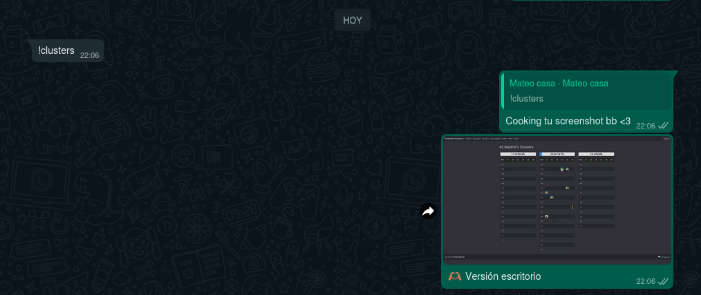

#  Freeze-Stalker WhatsApp Bot 🤖

## Introduction 🧐

First of all, why? At the 42 Madrid school, there are several ways to check the building clusters to see who is logged in, which means they are physically there. So, you can basically see who is at school. This only works if you have an active user login, which you won't have if you're not a student OR if you're on a "freeze" (vacation) 🥶.

This project was a gift for a very dear friend of mine who was on a "freeze," so he could still stalk us and check who was on campus, just for "the jaja's" - spanish meme, forget that.

This hardcoded bot emulates a web browser (Puppeteer), goes to the website, and logs in—all without any kind of security whatsoever. My `.env` file has my password and username (not even encrypted) - obviously, you won't find the `.env` file here. Make your own mistakes!

Now, this information may be under some legal protections, but unless you know my private phone number and use it to get a stupidly low-resolution screenshot with a few profile pictures... I wouldn't be too worried. 🤷‍♂️

This is a simple WhatsApp bot built with Node.js and the `whatsapp-web.js` library. Its main function is to take screenshots of a specific web page, in both desktop and mobile versions, and send them via WhatsApp 📲.

## Sample Screenshot 🖼️

Below is an example of a screenshot taken by the bot:



## Features ✨

*   **QR Authentication 📱:** Logs into WhatsApp Web by scanning a QR code.
*   **Web Screenshot (Desktop) 🖥️:** Takes a high-resolution screenshot of the configured URL (`WEB_URL`).
*   **Web Screenshot (Mobile) 📱:** Takes a screenshot emulating a mobile device (iPhone 12 Pro) of the configured URL (`WEB_URL`).
*   **Commands 💬:** Responds to specific commands to request screenshots or help.
*   **Session Management 🧹:** Includes a script to clear the saved WhatsApp session.
*   **Environment Variables 🔑:** Uses a `.env` file to manage credentials and the website URL.

## Prerequisites 📋

*   [Node.js](https://nodejs.org/) (latest LTS version recommended) 🟢
*   npm (usually installed with Node.js) 📦
*   An active WhatsApp number for the bot 📞

## Setup and Installation ⚙️

1.  **Clone the repository (or download the files) 📂:**
    ```bash
    # If it were on GitHub:
    # git clone https://github.com/Flingocho/freeze_stalker.git
    # cd freeze_stalker
    ```
    For now, ensure you have the `index.js`, `reset.js`, and `package.json` files in your project directory.

2.  **Install dependencies 🧩:**
    Navigate to the project directory in your terminal and run:
    ```bash
    npm install
    ```

3.  **Create the environment variables file 🤫:**
    Create a file named `.env` in the root of the project with the following content, replacing the example values with your actual credentials and desired URL:
    ```env
    WEB_URL=https://psegura.top/clusters/
    WEB_USERNAME=your_web_username
    WEB_PASSWORD=your_web_password
    ```
    **Important:** The `.env` file contains sensitive information and is included in the `.gitignore` so it won't be uploaded to public repositories.

## Running the Bot ▶️

1.  **Start the bot 🚀:**
    From the project directory, run:
    ```bash
    node index.js
    ```

2.  **Scan the QR Code 📷:**
    Upon starting, a QR code will be displayed in the terminal. Scan it with the WhatsApp application on your phone (from the Linked Devices section) to connect the bot.

3.  **Send Commands 📨:**
    Once the bot indicates "Bot ready and connected!", you can send it messages from any WhatsApp chat with the available commands.

## Additional Scripts 🛠️

*   **`reset.js`** ♻️:
    This script is used to clear the WhatsApp session saved by the bot. If you have trouble connecting or want to force a new QR authentication, you can run:
    ```bash
    node reset.js
    ```
    This will delete the `.wwebjs_auth/` folder where session data is stored.

## Available Commands 📜

*   `!help` (or `!ayuda`) ❓: Displays a list of available commands.
*   `!clusters` 🖥️: Requests a screenshot of the configured web page (desktop version).
*   `!clustersmovil` 📱: Requests a screenshot of the configured web page (mobile version, emulating an iPhone 12 Pro).

## Project Structure (Simplified) 🗂️

```
/home/calcifer/Escritorio/gifted/
├── index.js            # Main bot logic 🧠
├── reset.js            # Script to clear the session ♻️
├── package.json        # Defines project dependencies and scripts 📄
├── package-lock.json   # Records exact versions of dependencies 🔗
├── .env                # (Not versioned) Stores environment variables (credentials, URL) 🤫
├── .gitignore          # Specifies files and folders to be ignored by Git 🚫
├── screenshots/        # (Not versioned) Folder where screenshots are temporarily saved 🖼️
└── node_modules/       # (Not versioned) Folder with installed dependencies 📚
```

---

This README provides a basic guide to understand, configure, and run the bot. Happy stalking... I mean, screenshotting! 😄

